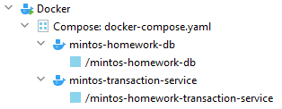
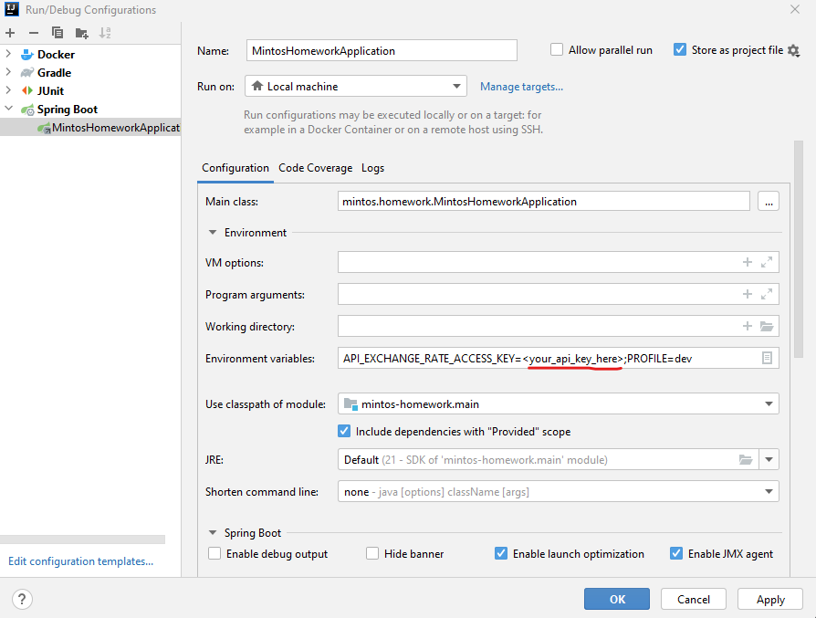
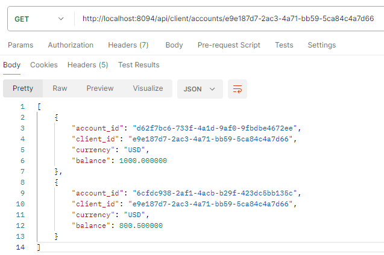
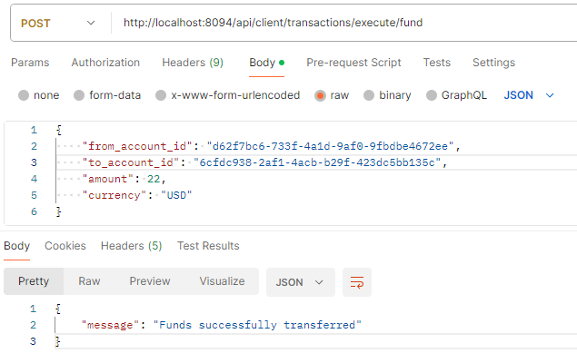

# mintos-homework

### Prerequisites

- `JDK 21` (Optional)
- `Docker`
- `https://www.exchangerate-api.com/` Api key for currency exchange rate

### Functional requirements

- Service should expose an HTTP API providing the following functionality:
- Given a client identifier, return a list of accounts (each client might have 0 or more
accounts with different currencies)
- Given an account identifier, return transaction history (last transactions come first)
and support result paging using “offset” and “limit” parameters
- Transfer funds between two accounts indicated by identifiers
- Balance must always be positive (>= 0).
- Currency conversion should take place when transferring funds between accounts with
different currencies
- For currency exchange rates, you can use any service of your choice, e.g.
[https://api.exchangerate.host/latest](https://api.exchangerate.host/latest)
- You may limit the currencies supported by your implementation based on what the
currency exchange rate service supports
- The currency of funds in the transfer operation must match the receiver's account
currency (e.g., system should return an error when requesting to transfer 30 GBP
from a USD account to an EUR account, however transferring 30 GBP from USD to
GBP is a valid operation - corresponding amount of USD is exchanged to GBP and
credited to GBP account).

### Non-functional requirements

As mentioned previously, the following list is given in order of priority, you may implement only part of
the items (more is better, however).
1. Test coverage should be not less than `80%`
2. Implemented web service should be resilient to 3rd party service unavailability
3. DB schema versioning should be implemented

## Run example

### 1. Run from Docker container

- In project root set `API_EXCHANGE_RATE_ACCESS_KEY` env in `docker-compose.yaml`
- Run command: `docker-compose up` 

- Wait until containers will up and ready
- Run requests or check `Swagger`

### 2. Run from an IDE

- Check that `JDK 21` for Java has been set up
- Set `API_EXCHANGE_RATE_ACCESS_KEY` env in predefined `.run` configuration 
  
- Run application. Running nn `dev` profile, database will be automatically set up from `compose.yaml` file

### Swagger

`http://localhost:8094/webjars/swagger-ui/index.html`

### Request examples

***Note:*** Predefined accounts can be used for requests: `resources/db/migration/V003__client_accounts_inserts.sql`

- Find account id by predefined client id 
   
- Send money from one account to other 
   
- Check `Swagger` for other endpoints

